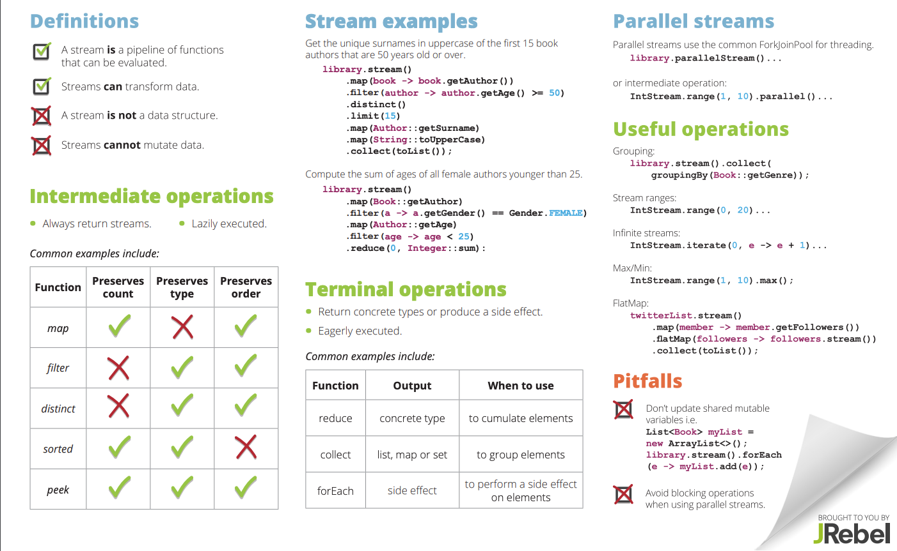
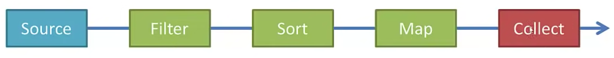

# Java Streams (Filter, Map, Reduce)

### A `stream` is a `pipeline` of `functions` that can be `evaluated`.   
Java streams are not a data structure and cannot mutate data; they can only transform data.  
## Streams bring functional programming to Java 8+



## Advantages of Streams:-
- Will make you more efficient Java Programmer
- Make heavy use of `Lambda Expressions`
- ParallelStreams make it very easy to multi-thread operations

## A Stream pipeline consists of a `Source`, <br /> followed by zero or more `intermediate operations`, <br /> and a `terminal operation`.



## Stream Source
Streams can be created from `Collections`, `Lists`, `ints`, `longs`, `doubles`, `arrays` and `lines of file` etc.

## Intermediate Operations
- Such as `filter`, `map` or `sort`
- Returns a stream so that we can chain multiple intermediate operations.
- Order matters do `filter first` then `sort` to improve the performance
- For larger datasets use ParallelStream to enable multiple threads.
- Includes: `anyMatch()`, `distinct()`, `filter()`, `findFirst()`, `flatMap()`, `map()`, `skip()`, `sorted()` etc.

## Terminal Operations
- Returns either void or a non-stream result.
- Only one terminal operation is allowed.
- Such as `forEach`, `collect` or `reduce`
- `forEach` applies the same function to each element.
- `collect` saves the elements into a collection.
- other options `reduce` the strem to s single summary element.
- Includes: `count()`, `max()`, `min()`, `reduce()`, `summaryStatistics()`


### reduce
```java
    // Print out the sum of ages of all female authors younger than 25.
        library.stream()
          .map(Book::getAuthor)
          .filter(author -> author.getGender() == Gender.FEMALE)
          .map(Author::getAge)
          .filter(age -> age < 25)
          .reduce(0, Integer::sum)
```
### collect
```java
   Stream<String> rows = Files.lines(Paths.get("./assets/data.txt"));
        Map<String, Integer> map = new HashMap<>();

        map = rows //Source
                .map(x -> x.split(",")) // operation 1
                .filter(x -> x.length == 3) // operation 2
                .collect(Collectors.toMap( // termination 
                        x -> x[0],
                        x -> Integer.parseInt(x[1])

                ));

        rows.close();

        for (String key : map.keySet()) {
            System.out.println(key + "-" + map.get(key));
        }
```
### forEach
```java
            IntStream // source
                .range(1, 10) // intermediate operation
                .forEach(System.out::println); // terminal operation
```

### IntStream
```java
            IntStream // source
                .range(1, 10) // intermediate operation
                .skip(5) // intermediate operation
                .forEach(System.out::println); // terminal operatio
```
### Sort Stream
```java
            Stream // source
                .of("Waleed", "Musa", "Maratib") // intermediate operation
                .sorted() // intermediate operation
                .findFirst() // intermediate operation
                .ifPresent(System.out::println); // terminal operation
```
### Filter and Sort Stream
```java
            Stream // source
                .of("Waleed", "Musa", "Maratib") // intermediate operation
                .filter(x -> x.startsWith("M"))
                .sorted() // intermediate operation
                .forEach(System.out::println); // terminal
```
### Files Lines
```java
        //data.txt
        // A,1,3.7
        // B,2,2.8
        // C,3,1.9
        // D,4,2.7
        // E
        // F,6,3.4
        
        Stream<String> rows = Files.lines(Paths.get("./assets/data.txt"));
        int rowCount = (int) rows // source 
                .map(x -> x.split(",")) // operation 1
                .filter(x -> x.length == 3) // operation 2
                .count(); // termination
        System.out.println("Rows Count: " + rowCount);

        rows.close();
```

### Example 1
```java
        library.stream()
          .map(book -> book.getAuthor())
          .filter(author -> author.getAge() >= 50)
          .map(Author::getSurname)
          .map(String::toUpperCase)
          .distinct()
          .limit(15)
          .collect(toList()));
```
### Example 2
```java
        library.stream()
          .map(Book::getAuthor)
          .filter(author -> author.getGender() == Gender.FEMALE)
          .map(Author::getAge)
          .filter(age -> age < 25)
          .reduce(0, Integer::sum)
```
### Parallel Streams
```java
     library.parallelStream()...
     IntStream.range(1, 10).parallel()...
```
### Example 3
```java
    List myList = new ArrayList<>();
    library.parallelStream().forEach(e -> myList.add(e));
```
