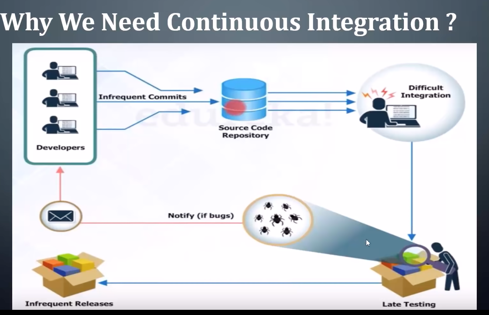
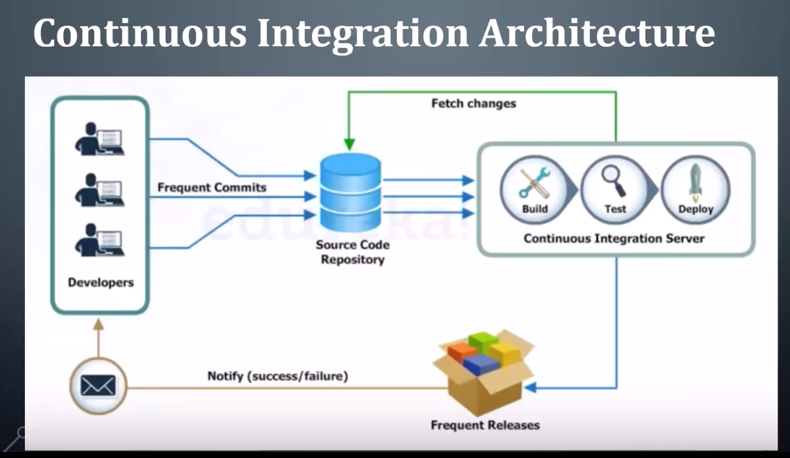
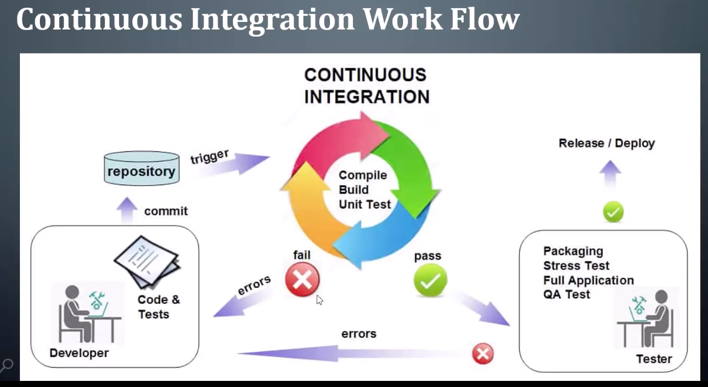
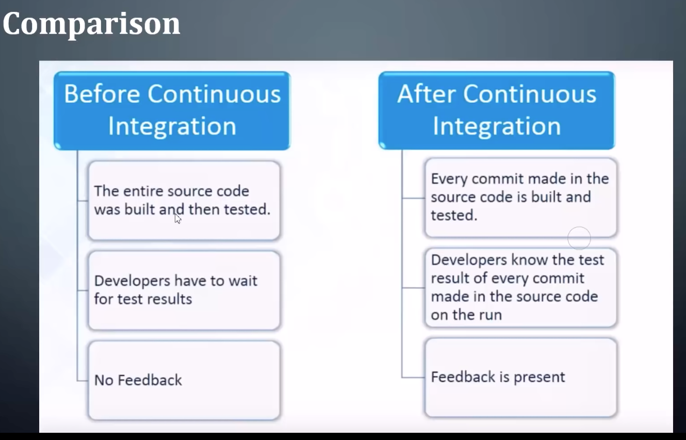

# What is Jenkins

- Jenkins is a CI/CD tool used to (build, compile and test) code and deploy it to the production server.

- It has bunch of plugins to support building, deploying and automating any project.

- It is a server-based system that runs in servlet container (Tomcat)

- It supports version control tools like SVN, Git to automate build.

### What is Continuous Integration (CI)

- CI is a process in which all development work is integrated as early as possible.

- The resulting artifacts are automatically created and tested.

- This process allows to identify errors as early as possible.

### Resources :

[Jekins - Java Techie](https://youtu.be/1QLMqyFFEzU?si=IR207ynGhIsXyKnw)

