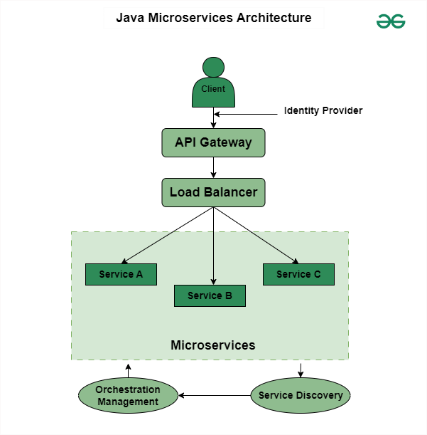
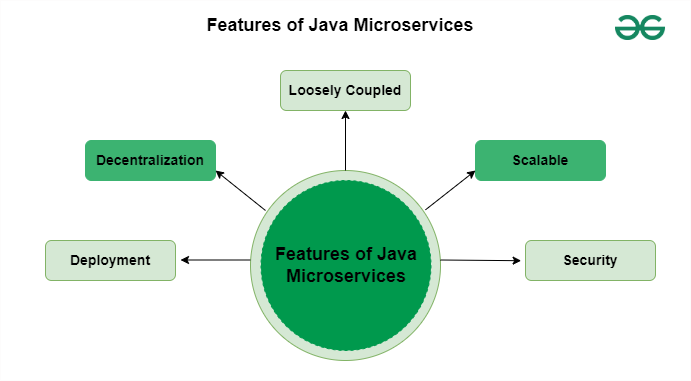
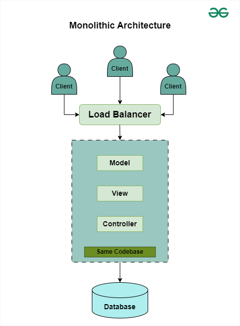
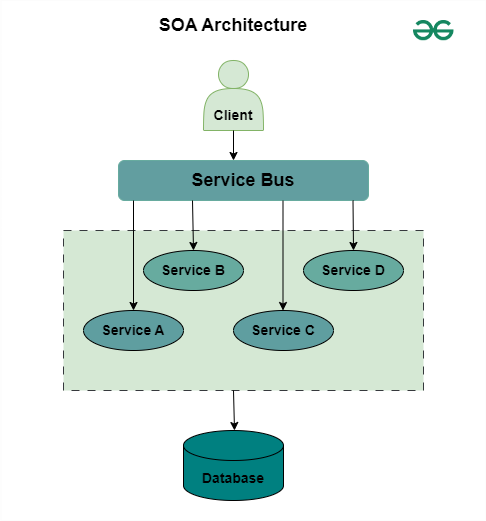

# Java Microservices Interview Questions and Answers

Microservices is a software development approach that involves `building large applications as a collection of small functional modules.`  
 This architectural approach is widely adopted due to its ease of maintenance and faster development process.

`Microservices with the Spring Boot` framework `break down complex applications` into `smaller and loosely coupled services`, each focusing on a specific business capability. This architecture promotes `agility, scalability, and resilience`, leveraging technologies like `Docker, Kubernetes, and RESTful APIs` for seamless communication and deployment in distributed environments.

### What are microservices?

Microservices is an architecture in which the application performs as a loosely coupled service that can be developed, deployed, and maintained independently. Each service in this architecture is called a Microservice.

In Microservices, each service performs a different and unique function.
Through APIs it communicates with other services by focusing on the business strategies.
Different microservices can be used for different architecture and languages.

- Microservices is an architectural style.
- An approach to develop a single application as a suite of small services.
- Each running in its on process independently.
- And communicating via lightweight mechanisms, often HTTP RestAPI
- Each Service is independently deployable via automated deployment tools.
- Each Service can be written in a different programming language.
- Each Service can be managed by differently.

### Benefits of using microservices

- Developers can become productive quickly
- Parallel development by different teams
- Efficient Scaling
- Develop using multiple languages (Polyglot)
- Polyglot persistence.

### 2. When and Why to use Microservices?

For large or complex projects microservices are the best choice for scalability, flexibility, and faster development with evolving requirements. Microservices are useful when the application needs to be more scalable and manageable or requires more resources.

Microservices are ideal when the monolithic applications need to be optimized and modernized.

Each service can be independently developed, deployed, and maintained.

To reduce time, for scalability, fast development, low cost, and cloud-native development microservices are ideal.

We should not use microservices for simple applications which can be managed by monolithic architecture.

### 3. Explain the workings of Java Microservices Architecture.

In Java Microservices architecture, an application is divided into small processes or we can call them sub-processes. Each process runs on its functionality. All the sub-processes communicate with each other through small protocols. It manages better scalability and coordination between services.

Below is the Architectural diagram of Java Microservices:



### 4. What are the Pros and Cons of Java Microservices?

There are so many benefits and drawbacks in Java Microservices architecture.

#### Pros:

- We can use different technologies using microservices.
- It takes care of the security of each service.
- More than one service can be parallelly developed and deployed.
- Services are independently managed.
- Better scalability and agility.

#### Cons:

- Communication between microservices can be complex.
- Large numbers of service management is difficult.
- Handling microservices with different business requirements is a tough task.
- So many configurations have to do which increases efforts.
- Network maintenance is difficult.
- Complex development and Security issues.

### `5. What are the main features of Java Microservices?`

There are so many features of Java Microservices. Some of the main features are listed below:



- `Deployment:` It breaks an application into small services, because of this it is possible to deploy and develop each of these services independently.
- `Decentralization:` Data storage management is decentralized. Each of the services has its own data related to a particular business functionality.

- `Loosely Coupled:` If a single process fails, it will not affect the other services and the entire system.

- `Security:` It provides authentication and authorization based on the Role-based access model (RBAC).

- `Scalable:` Based on the requirements, services can be scaled which results in better scalability.

### `6. What is Monolithic architecture?`

A monolithic architecture-based application is built as a single unit means inside a single code base, all the functionality and modules of the application are available.

- Before microservices, all modules were there in a single project.
- It supports tightly coupled architecture.



- Here, we have a server. The server can be Tomcat, jetty, or any type.
- In this server, we have deployed our application.
- Inside this web application, we need to deploy all the modules of an application.
- The outcome will be a WAR file. Only if we deploy the war file, these modules will be available.
- This is the Monolithic Architecture.

### `7. Explain SOA.`

`SOA refers to Service-Oriented Architecture.`

- SOA architecture is a collection of multiple services.
- These multiple services do communicate with each other by using some standardized protocols.
- Also in this design approach, applications are build as a collection of services that are loosely coupled.



It communicates with each service over a network and then implements a specific business function. The communication could be the normal passing of data or more than two services sharing some common activity or any type of coordination.

### `8. What is the difference between Monolithic, SOA, and Microservices Architecture?`

Below are the basic differences between the Monolithic, SOA, and Microservices Architecture.

<table>
<tr><td>Features</td><td>Monolithic</td><td>SOA</td><td>Microservices</td></tr>
<tr><td>Structure</td><td>A single application where all software components are assembled and tightly coupled.</td><td>Collection of services and loosely coupled.</td><td>Collection of small services and services independently deployable.</td></tr>
<tr><td>Communication</td><td>Within the same application, components communicate with each other.</td><td>Using some standardized protocols, services communicate with each other.</td><td>Through some lightweight protocols, all the services communicate with each other.</td></tr>
<tr><td>Scalability</td><td>Scaling is required according to the needs of the entire application.</td><td>All services can be scaled independently.</td><td>All the services can be scaled independently according to the business requirement.</td></tr>
<tr><td>Development and Deployment</td><td>It maintains centralized development and components deployed as a single unit.</td><td>It also maintains centralized development and here the services are deployed as monolithic applications.</td><td>It maintains decentralized development and services deployed independently.</td></tr>
</table>

### `9. Explain the design patterns of Java Spring Boot Microservices?.`

- `Service Registry and Discovery:` Services automatically register in a central registry, allowing others to identify and interact with them dynamically.

- `API Gateway:` It acts as a customer entry point and forwards requests to appropriate microservices to provide additional functionality such as authentication and rate limits.

- `Circuit Breaker:` It monitors the availability of services and protects from failures by sending requests or by providing responses if service is unavailable.

- `CQRS (Command Query Responsibility Segregation):` It separates the read and write operations. Also, it optimizes each and every operation separately for efficiency.

- `Saga Pattern:` It manages distributed tasks by organizing a sequence of local transactions.

- `Database per service:` Each of the services has separate databases. This ensures data isolation and also enables scaling and individual development.

- `Asynchronous messaging:` Each services communicate with each other through message queues like Kafka or RabbitMQ.

### `10. What are the Main Components of Java Spring Boot Microservices?`

The main components of Java Spring Boot Microservices include:

- Services
- Service Registry
- API Gateway
- Cloud Infrastructure
- Containerization and Orchestration
- Message Broker
- Security
- Monitoring

### `11. Name three commonly used tools for Java Spring Boot Microservices?`

There are different tools used for Java Spring Boot Microservices, some important tools are,

`Docker:` This is a containerization tool that allows developers to put applications and their dependencies in a lightweight container, and provide stability across multiple environments.

`Kubernetes:` This is an open-source container orchestration tool and it automates the scaling, deployment, and management of containerized applications. It offers features like service discovery, load balancing etc.

`Spring Cloud:` This is a framework in the Spring ecosystem for building microservice-based applications. It is used to develop cloud-native applications. It offers features like service discovery, configuration management, circuit breakers etc.

### `12. How do Microservices Communicate with each other?`

In Microservices, multiple services run independently. Services communicate with each other through,

`HTTP/REST:` These are light-weight protocols used for perform communication between two services.

`Message queues:` Message queues such as Kafka or RabbitMQ used to make connection.

`RPC (Remote Procedure Call) Framework:` RPC frameworks such as gRPC uses in services for communication purposes.

These methods of communication enable loosely coupled interaction, scalability, and flexibility in distributed systems.

### `13. How to Process the Request and Response between Two Services?`

By establishing communication between the two services, microservices can handle requests and responses between any two services using XML and JSON.

- XML and JSON are data exchange formats and it helps to generate requests and responses between two services.

- Most important thing is the data exchange format and both the services have to know the data exchange format to request and respond accordingly.

- If we compare both formats, JSON is very simple to use in Microservices.

## Java Microservices Interview Questions for Intermediate

### `14. What is WebClient and How Java Microservices Communicate using WebClient?`

An interface called WebClient represents the primary access point for web requests. It is also known as Reactive Web Client that is introduced in Spring 5. The new client is a non-blocking, reactive solution that works over HTTP/1.1 protocol. Also, it is the replacement of classic RestTemplate. We can use the WebClient for Java Microservices Communication by the following approach.

Add this dependency to the pom.xml file:

```xml
<dependency>
    <groupId>org.springframework.boot</groupId>
    <artifactId>spring-boot-starter-webflux</artifactId>
</dependency>
```

After adding this library, create a Bean for the WebClient in the configuration file like below:

```java
@Bean
public WebClient webClient() {
return WebClient.builder().baseUrl(addressBaseUrl).build();
}
```

After creating Bean, it is ready for use in the Service Class file. We can refer the below code:

```java
@Service
public class EmployeeService {

    // More Code Here


    // -------------

    @Autowired
    private WebClient webClient;

    public EmployeeResponse getEmployeeById(int id) {


    // More Code Here

    // --------------


        // Using WebClient
        AddressResponse addressResponse = webClient.get().uri("/address/" + id).retrieve().bodyToMono(AddressResponse.class).block();
        employeeResponse.setAddressResponse(addressResponse);

        return employeeResponse;
    }

}
```

For more details please refer to this article: Spring Boot Microservices Communication using WebClient with Example

### `15. What is RestTemplate and How Java Microservices Communicate using RestTemplate?`

The RestTemplate is a synchronous REST client that performs HTTP requests by using a simple API of template style.

- This is a synchronous client and it is designed to call the REST services.
- RestTemplate class plays a very major in Spring Boot Microservices Communication.

We can use RestTemplate for Java Microservices Communication by the following approach:

Microservices can communicate using RestTemplate.getForObject() method. Syntax of RestTemplate.getForObject() method is given below.

```java
@Nullable
public <T> T getForObject(String url, Class<T> responseType, Object... uriVariables) throws RestClientException {
RequestCallback requestCallback = this.acceptHeaderRequestCallback(responseType);
HttpMessageConverterExtractor<T> responseExtractor = new HttpMessageConverterExtractor(responseType, this.getMessageConverters(), this.logger);
return this.execute(url, HttpMethod.GET, requestCallback, responseExtractor, (Object[])uriVariables);
}
```

### `16. What is FeignClient and How Java Microservices Communicate using FeignClient?`

`FeignClient is known as Spring Cloud OpenFeign.`

- It is a declarative REST Client in Spring Boot Web Application. Declarative REST Client means to specify the client specification as an Interface and spring boot will take care of the implementation.

- With the help of FeignClient, writing web services is very simple.

- It is mostly used to consume REST API endpoints exposed by third parties or microservices.

We can use FeignClient for Java Microservices Communication by the following approach:

Add this dependency to the pom.xml file.

```xml
<dependency>
    <groupId>org.springframework.cloud</groupId>
    <artifactId>spring-cloud-starter-openfeign</artifactId>
</dependency>
```

After adding the library, add this @EnableFeignClients annotation to the main Application file as below:

```java
@SpringBootApplication
@EnableFeignClients
public class Application {

    public static void main(String[] args) {
        SpringApplication.run(Application.class, args);
    }

}
Create an Interface and define it with @FeignClient annotation and declare calling method as below:

@FeignClient(name = "giveHereServiceName", url = "provideUrlHere", path = "provideContextPathHere")
public interface AddressClient {

    @GetMapping("/address/{id}")
    public ResponseEntity<AddressResponse> getAddressByEmployeeId(@PathVariable("id") int id);

}
```

Now it is ready to be used in the service class file. You can see the below code:

```java
@Service
public class EmployeeService {

    // More Code Here


    // -------------

    // Spring will create the implementation
    // for this class
    // and here it will insert the bean (proxy) .
    @Autowired
    private AddressClient addressClient;

    public EmployeeResponse getEmployeeById(int id) {

        // More Code Here

        // Using FeignClient
        ResponseEntity<AddressResponse> addressResponse = addressClient.getAddressByEmployeeId(id);
        employeeResponse.setAddressResponse(addressResponse.getBody());

        return employeeResponse;
    }

}
```

### `17. How Client Side Load Balancing Happens in Java Spring Boot Microservices?`

When a load balancer put on the client side along with assigning load balancing responsibilities to the client, this is called Client-Side Load Balancing. Spring Cloud LoadBalancer is one of the most popular client-side load balancers offered by Spring Cloud.

Spring Cloud LoadBalancer can be used for Client Side Load Balancing in Microservices by the following approach:

Add the following dependencies to pom.xml file.

```xml
<dependency>
      <groupId>org.springframework.cloud</groupId>
      <artifactId>spring-cloud-starter-loadbalancer</artifactId>
</dependency>
```

Client Side Load Balancing can be done with the help of LoadBalancerClient. We need to write the following logic in our client microservice in the Service class.

```java
@Autowired
private RestTemplate restTemplate;

@Autowired
private LoadBalancerClient loadBalancerClient;

// Get ServiceInstance list using serviceId
ServiceInstance serviceInstance = loadBalancerClient.choose("ADDRESS-SERVICE");

// Read URI and add the path that returns url
String uri = serviceInstance.getUri().toString();

// Get metadata
String contextPath = serviceInstance.getMetadata().get("configPath");

// HTTP call and got Response data
AddressResponse addressResponse = restTemplate.getForObject(uri + contextPath + "/address/{id}", AddressResponse.class, id);
```

### `18. How Load Balancing Happens in Java Spring Boot Microservices using Netflix’s Ribbon?`

Ribbon is a special load balancer provided by Netflix so that we do not have to create this load balancer or write any code to make this pattern possible. We can only use the Netflix Ribbon for having the client-side load balancing.

We can use Netflix’s Ribbon for Load Balancing in Microservices by the following approach

Add the following dependency in pom.xml file:

```xml
<dependency>
    <groupId>org.springframework.cloud</groupId>
    <artifactId>spring-cloud-starter-netflix-ribbon</artifactId>
</dependency>
```

Annotate your Feign Client interface with @RibbonClient. Refer to the below code snippet.

```java
@FeignClient(name = "address-service", path = "/address-service")
@RibbonClient(name = "address-service")
public interface AddressClient {

    @GetMapping("/address/{id}")
    public ResponseEntity<AddressResponse> getAddressByEmployeeId(@PathVariable("id") int id);

}
```

Make the following changes to the application.properties file.

```json
address-service.ribbon.listOfServers=http://localhost:8081, http://localhost:8082
```

### `19. How Eureka Server and Client Communicate with Each Other in Java Microservices?`

`Service discovery` is one of the key issues in microservices-based architecture. The `Eureka is Netflix service discovery`, consists of a discovery server and a client. The server can be configured and deployed to maximize performance, with each server copying the status of registered services to the others.

Suppose, our discovery service is running on the port number 5000,

`server.port=5000`

Now if we run our microservice then we may get the “Connection refused” error. To fix this, we have to add the following line in the application.properties file of microservice.

`eureka.client.service-url.defaultZone=http://localhost:5000/eureka/`

This will fix our issue.

### `20. How to Develop API Gateway in Java Spring Boot Microservices?`

We can develop API Gateway in Java Spring Boot Microservices by using Spring Cloud Gateway. `Spring Cloud Gateway` provides a library for creating API gateways over Spring and Java. It provides a flexible way to submit standards-based requests, while focusing on contextual issues such as security, resiliency, and monitoring Spring Cloud Gateway features some of the most important ones are:

- It is Built on Spring Framework 5, Project Reactor, and Spring Boot 2.0
- We can integrate the Circuit Breaker with the Spring Cloud Gateway.
- We can integrate Spring Cloud DiscoveryClient.
- Predicates and filters are specific to routes.
- Path Rewriting.
- It can match routes on any request attribute.

## Java Microservices Interview Questions for Experienced

### 21. `How to Register Java Microservices Using Netflix Eureka?`

The Eureka is the Netflix service discovery, consists of a discovery server and a client. The server can be configured and deployed to maximize performance, with each server copying the status of registered services to others. To Register and Discover Microservices Using Netflix Eureka we have to develop one Service Discovery and one Microservice.

- Developing Microservice or Eureka Client
- Developing Service Discovery or Eureka Server

### `22. What is Client Side Service Discovery in Java Microservices and Provide Some Examples of It?`

`In microservices, Service discovery refers to the process of dynamically locating and connecting to available services within a distributed system.`

- In a microservice system, applications perform multiple tasks and that are composed of many independently deployable services.

- Service discovery is critical to facilitate communication between these different services.

- If we put Service Discovery in client side then we called it as Client Side Service Discovery.

Example: `Netflix Eureka`, `Zookeeper`, `Consul`

### `23. What is Server Side Service Discovery in Java Microservices and Provide Some Examples of It?`

In microservices, Service discovery refers to the process of dynamically locating and connecting to available services within a distributed system.

- In a microservice system, applications perform multiple tasks and that are composed of many independently deployable services.

- Service discovery is critical to facilitate communication between these different services.

- If we put Service Discovery in server side then we called it as Server Side Service Discovery.

Example: `NGNIX`, `AWS ELB`

### `24. Why Use Spring Cloud for Microservices Development?`

Spring Cloud is a project under which we have many sub-projects. We can solve all these problems with those sub-projects.

- Spring Cloud Config Server

- Service registration and discovery using Eureka

- Spring Cloud LoadBalancer

- resilience4j-ratelimiter

- Circuit Breakers Pattern

### `25. Explain 5 Major Challenges and Solutions of Java Spring Boot Microservices Architecture?`

There are 5 challenges are mentioned below with solutions that we might face while developing microservices applications.

- Challenge 1: Service Configuration Management

  - Solution: Spring Cloud Config Server centralizes configuration management for microservices.

- Challenge 2: Service Discovery and Registration

  - Solution: Eureka enables dynamic service discovery and registration.

- Challenge 3: Load Balancing Across Microservices
  Solution: Spring Cloud LoadBalancer distributes traffic evenly among microservice instances.

- Challenge 4: Resilience and Fault Tolerance

  - Solution: resilience4j-ratelimiter implements rate limiting to maintain stability under heavy load.

- Challenge 5: Handling Failures and Circuit Breakers
  - Solution: Circuit Breaker pattern with tools like Hystrix provides fault isolation and fallback mechanisms.

### `26. Tell Some Major Reasons to Choose Spring Boot For Microservices Development?`

Here are some major reason to Choose Spring Boot For Microservices Development.

- Embedded Server
- Support Load Balancer
- Auto Configuration
- Minimal Code using Annotations
- Loose Coupling
- Dependency Management
- Open Source

### `27. What is Circuit Breaker Pattern in Java Microservices?`

Circuit Breaker pattern in microservices follows fault-tolerance mechanism. It monitors and controls the interaction between different services. It dynamically manages service availability by temporarily canceling requests for failed services, prevents system overloading, and ensures graceful degradation in distributed environments. Circuit Breaker pattern typically operates in three basic states: Closed, Open, and Half-Open.

Here are some Characteristics of Circuit Breaker pattern:

- Fault Tolerance
- Resilience
- Monitoring
- Failure Isolation
- Fallback Mechanism
- Automatic Recovery

### `28. Explain Different Deployment Techniques to Deploy Java Microservices?`

There are different ways to deploy Microservices. Some of them are mentioned below:

- `Single Machine`, Multiple Services: Buy a server and run microservices as services.

- `Multiple Machines`, Multiple Services: When application exceeds the capacity of the server, we can upgrade the server by scaling up (Add more Servers).

- `Containerization:` Each microservices runs independently by enabling flexibility and scaling as per demand.

- `Orchestrators:` It distributes the workload of a container over a group of servers. (Ex: Kubernetes)

- `Serverless Deployment:` Processes or containers use cloud to run code on demand.

### `29. What is the Main role of Docker in Microservices and How to deploy microservices in Docker?`

The main role of Docker in microservices is to provide containerization, which allows each microservice with its dependencies to coordinate with the runtime environment, ensuring stability in unique environments.

Steps to deploy microservices in Docker:

- Step 1: Containerize each microservice by creating a Dockerfile specifying the application’s dependencies and runtime configuration.

- Step 2: Build Docker images for each microservice using the docker build command.

- Step 3: Push the built Docker images to a Docker registry such as Docker Hub or a private registry.

- Step 4: Create Docker Compose or Kubernetes manifests defining the configuration for deploying and orchestrating the microservices.

- Step 5: Deploy the Dockerized microservices using Docker Compose or Kubernetes by running docker-compose up or applying the Kubernetes manifests respectively.

- Step 6: Monitor and manage the deployed microservices using Docker CLI commands or Kubernetes dashboard.

### `30. How to Deploy Java Spring Boot Microservices in AWS?`

To deploy our microservices application in AWS (Amazon Web Services), we need to follow the below steps.

- Step 1: In the first step, open the AWS Management Console and then go to EC2.

- Step 2: After that, click on the Load Balancers and create a new Application Load Balancer. Also, create a new target group associated with that load balancer. Then define the target group targets (ECS instances) and health checks.

- Step 3: Now, in AWS Management Console, go to ECS and create a new ECS cluster.

- Step 4: Then choose the networking options and click on next.

  - Configure the cluster give name to the cluster.
  - Then create ECS Task and click on the repository.
  - Now, configure the repository and make sure it is private.
  - Lastly, create the Task Definitions.

- Step 5: Now update the ECS Task.

Conclusion
Microservices are also highly beneficial for modern software development methods like DevOps and Agile. Adopting this approach helps in delivering large, complex applications promptly, frequently, and reliably.

Many companies such as Netflix, Amazon, Ebay, Uber, and Spotify adopt microservices in order to manage complex systems in large-scale operations. With a booming demand for Microservices Developers, now is the perfect time to gear up for interviews and capitalize on this dynamic market.

Microservices Interview Questions – FAQs
What is the typical salary range for a microservices developer in USA?
In USA, microservices developers typically earn between $90,000 to $150,000 annually, depending on experience, location, and the specific sector they work in.

What does Microservices Developer do?
A Microservices Developer specializes in designing, building, and maintaining small, independent, and loosely coupled services. They work on developing applications where each microservice runs a unique process and communicates through a well-defined, lightweight mechanism to serve a business goal. Developers handle the full lifecycle of these services, from design through development, testing, deployment, and support.

What are the essential skills required for a Microservices developer?
Essential skills for a Microservices developer include:

- Proficiency in programming languages
- Understanding of containerization technologies
- Familiarity with CI/CD tools
- Experience with RESTful services and APIs
- Knowledge of database management
- Understanding of cloud platforms
- Strong debugging and troubleshooting skills
