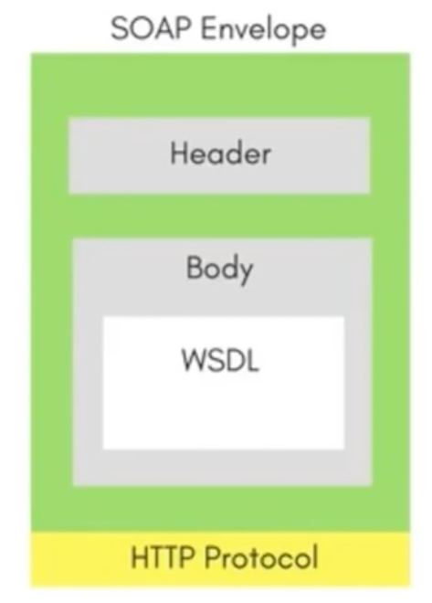

# SOAP 

SOAP is a lightweight protocol for exchanging structured information in a decentralized, distributed environment.

This contains rules guiding requests and responses sent from web applications using XML between systems through HTTP.

- SOAP stands for `Simple Object Access Protocol`
- SOAP is an XML based protocol
- The biggest advantage of using the SOAP Web Services is `its own security`
- SOAP provides an envelope to send a weg services message over the internet using the HTTP protocol.
- The messages are generally in XML format. 
- SOAP is a technique to send an XML request over the internet using HTTP protocol.  

### SOAP Envelope contains
<table>
<tr><td valign="top"><ul>
<li>Header</li>
<li>Body (contains WSDL)</li>
<li>HTTP Protocol</li>
<li>Note: WSDL - Web Services Description Language</li>
</ul></td>
<td></td>
</tr>
</table>
