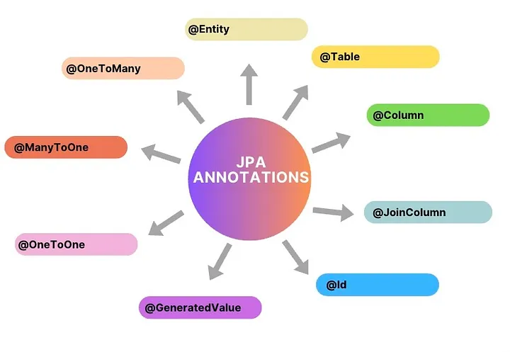
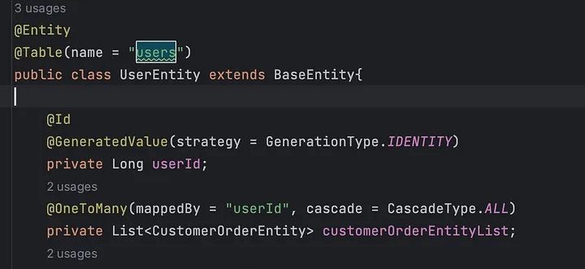
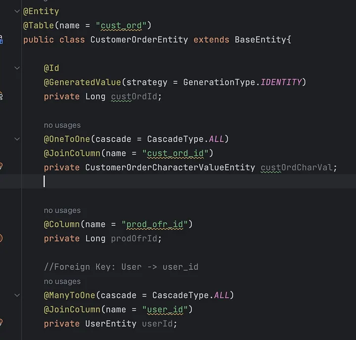
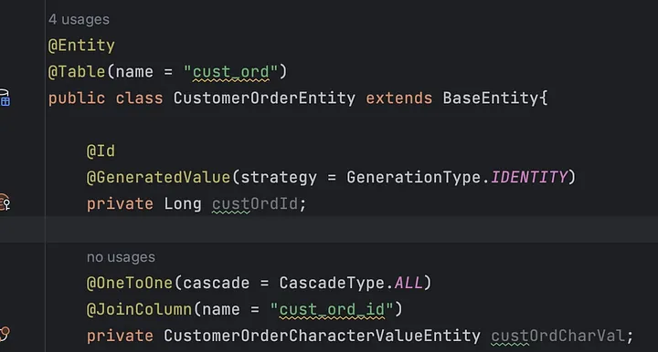
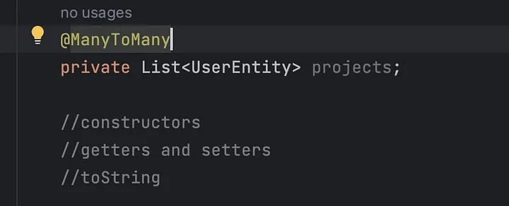

# JPA Annotations

### `@Entity`

Specifies that the class is an entity. This annotation can be applied to Class, Interface of Enums.

### `@Table`

It is used to specify the table name. `@Table(name = "users")`

### `@Id`

This annotation specifies the primary key of the entity.

### `@Column`

This annotation is used to define the column name of the table. `@Column(name = "firstName")`

### `@OneToMany`

When an entity is linked to many other entities, one-to-many relationships are used.

In the example below, the userId primary key from the User Entity Class is also the foreign key of the Customer Order Entity Class. So we can understand from the example that there can be more than one customer order for a user.

Using the one-to-many relationship, we indicate that one userId in the user class can have many customer orders from our other class called customer order. The list structure is used to express the multiplicity while specifying this.

### `@ManyToOne`

This annotation is used when various attributes in a table are associated with one attribute only.

More than one customer order can go to a single user. In the example below, after specifying the relationship of the Customer Order Entity Class with the User Entity Class, we specify where to connect it to the column by saying @ JoinColumn. Then we finish our definitions by creating an object from the class we want to combine.

### `@OneToOne`

When each record in one entity (table) is linked to exactly one record in another entity, and vice versa.

Each id (in our example the id is from the cust_ord_id Customer Order Entity Class) can only have one char value (in Customer Order Character Value Entity Class).

In summary, using this annotation, we connect the id (cust_ord_id) of the Customer Order Entity Class with the id of the Customer Order Char Value Entity Class using a one-to-one relation.

We see this in the example below:

### `@ManyToMany`

When multiple records in a table are associated with multiple records in another table, there is a many-to-many relationship.

